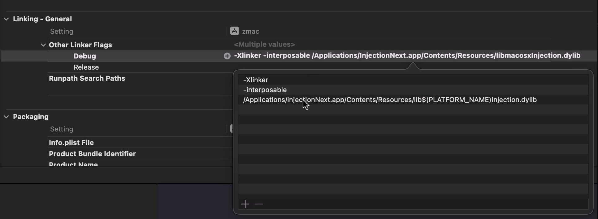

# InjectionNext

### The fourth evolution of Code Injection for Xcode

Using a feature of Apple's linker this implementation of Code Injection
allows you to update the implementation (i.e. body) of functions in your
app without having to relauch it. This can save a developer a significant
amount of time tweaking code or iterating over a design.

This repo is a refesh of the [InjectionIII](https://github.com/johnno1962/InjectionIII)
app that uses a different technique to determine how to rebuild source files
that should be faster and more reliable for very large projects. Gone is the 
involved parsing of Xcode build logs (if you can locate them) and messy 
eascaping of special characters in filenames. A new app is used to launch Xcode 
with a [SourceKit debugging flag](https://www.jpsim.com/uncovering-sourcekit/) 
enabled which provides all the information you need to be able to recompile
files and then the runtime implementation of injection included in the
[InjectionLite](https://github.com/johnno1962/InjectionLite) package looks after the rest.

The basic MO is to build the app in the `App` directory, quit Xcode and run the
resulting `InjectionNext.app` and use that to re-launch Xcode using the menu item 
`Launch Xcode` from the status bar. You then add this repo as a Swift package 
dependency of your project and that should be all that is required for injection 
in the simulator, injection on devices and injection of a MacOS app. No more 
code changes required to load binary code bundles etc required and you can
leave the InjectionNext package configured into your project permanently as
its code is only included for a DEBUG build. Your code changes take effect
when you save a source for an app that has this package as a dependency
and has connected to the InjectIonNext app which has launched Xcode.

As ever, it is important to add the options `-Xlinker` and `-interposable` 
(without double quotes and on separate lines) to the "Other Linker Flags" of 
the targets of your project (for the `Debug` configuration only) to enable 
"interposing". Otherwise, you will only be able to inject non-final class methods.

When your app runs it should connect to the `InjectionNext.app` and it's icon
change to orange. After that, by parsing the messages from the "supervised"
launch of Xcode it is possible to know when files are saved and exactly how
to recompile them for injection. Injection on a device uses the same 
configurtion but is opt-in through the menu item "Enable Deivces"
(as it needs to open a network port). You also need to enter the 
project's "expanded codesigning identity" from the codesigning
phase of your build logs into the window that pops up.

To inject tests on a device: When enabling the "Enable Deivces" menu item
select "Enable testing on device" which will add the parameters shown
to the link of each dynamic library. As you do this a command will be
inserted into the clipboard which you should add to your project as a 
"Run Script" "Build Phase" to copy the required libraries into the
app bundle. Whenever you start to get code signing errors restart Xcode.

This version of injection is a jealous technology and doesn't interact well
with the SwiftUI #Preview macro. To avoid problems, surround your previews 
with `#if !INJECTING` which will be defined when recompiling for injection.

For more information consult the [original InjectionIII README](https://github.com/johnno1962/InjectionIII)
or for the bigger picture see [this swift evolution post](https://forums.swift.org/t/weve-been-doing-it-wrong-all-this-time/72015).

The colors of the menu bar icon bar correspond to:

* Blue when you first run the InjectionNext app.
* Purple when you have launched Xcode using the app.
* Orange when your client app has connected to it.
* Green while it is recompiling a saved source.
* Yellow if the source has failed to compile.

Please note: you can only inject changes to code inside a function body
and you can not add/remove or rename properties with storage or add or 
reorder methods on a non final class or change function arguments.

The fabulous app icon is thanks to Katya of [pixel-mixer.com](http://pixel-mixer.com/).
