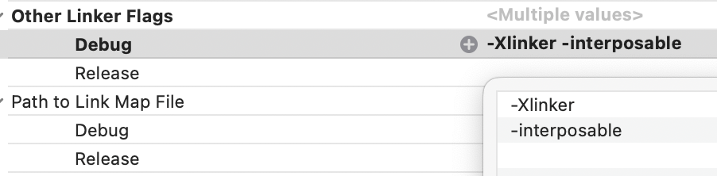

# InjectionNext

### The fourth evolution of Code Injection for Xcode

Using a feature of Apple's linker this implementation of Code Injection
allows you to update the implementation (i.e. body) of functions in your
app without having to relaunch it. This can save a developer a significant
amount of time tweaking code or iterating over a design. This repo is a 
refresh of the [InjectionIII](https://github.com/johnno1962/InjectionIII)
app that uses different techniques to determine how to rebuild source files
that should be faster and more reliable for very large projects.

The basic M.O. is to download one of the binary releases in this repo (or build 
the app in the `App` directory), move it to /Applications, quit Xcode and run the
`InjectionNext.app` and use that to re-launch Xcode using the menu item 
`Launch Xcode` from the status bar. You then add this repo as a Swift package 
dependency of your project and that should be all that is required for injection 
in the simulator, injection on devices and injection of a MacOS app. No more 
code changes required to load binary code bundles etc and you can leave 
the InjectionNext package configured into your project permanently as
its code is only included for a DEBUG build. Your code changes take effect
when you save a source for an app that has this package as a dependency
and has connected to the InjectIonNext app which has launched Xcode.

As ever, it is important to add the options `-Xlinker` and `-interposable` 
(without double quotes and on separate lines) to the "Other Linker Flags" of 
the targets of your project (for the `Debug` configuration only) to enable 
function "interposing". Otherwise, you will only be able to inject non-final
class methods.



**Please note:** you can only inject changes to code inside a function body
and you cannot add/remove or rename properties with storage or add or 
reorder methods in a non final class or change function signatures.

To inject SwiftUI sucessfully a couple of minor code changes to each View are 
required. Consult the README of repo https://github.com/johnno1962/HotSwiftUI
or you can make the required changes automatically using the menu item
"Prepare SwiftUI/...". For SwiftUI you would generally also integrate
either the [Inject](https://github.com/krzysztofzablocki/Inject) or
[HotSwiftUI](https://github.com/johnno1962/HotSwiftUI) package into your project. 

If you'd rather not be adding a SPM dependency to your project, the app's
resources contains pre-built bundles which you can copy into your app during
the build by using a "Run Script/Build Phase" (while disabling the "user 
script sandboxing" build setting) such as the following:

```
export RESOURCES="/Applications/InjectionNext.app/Contents/Resources"
if [ -f "$RESOURCES/copy_bundle.sh" ]; then
    "$RESOURCES/copy_bundle.sh"
fi
```
These bundles should load automatically if you've integrated the
[Inject](https://github.com/krzysztofzablocki/Inject) or
[HotSwiftUI](https://github.com/johnno1962/HotSwiftUI) packages into your project. 
Otherwise, you can add the following code to run at startup of your app:

```
    #if DEBUG
    if let path = Bundle.main.path(forResource:
            "iOSInjection", ofType: "bundle") ??
        Bundle.main.path(forResource:
            "macOSInjection", ofType: "bundle") {
        Bundle(path: path)!.load()
    }
    #endif
```
The binary bundles also integrate [Nimble](https://github.com/Quick/Nimble)
and a slightly modified version of the [Quick](https://github.com/Quick/Quick) 
testing framework to inhibit spec caching under their respective Apache licences.

An alternative to loading a bundle is to add the following additional "Other Linker Flag":

`/Applications/InjectionNext.app/Contents/Resources/lib$(PLATFORM_NAME)Injection.dylib`

When your app runs it should connect to the `InjectionNext.app` and it's icon
change to orange. After that, by parsing the messages from the "supervised"
launch of Xcode it is possible to know when files are saved and exactly how
to recompile them for injection. Injection on a device uses the same 
configuration but is opt-in through the menu item "Enable Devices"
(as it needs to open a network port). You also need to select the 
project's "expanded codesigning identity" from the codesigning
phase of your build logs in the window that pops up. Sometimes a 
device will not connect to the app first time after unlocking it.
If at first it doesn't succeed, try again.

The colours of the menu bar icon bar correspond to:

* Blue when you first run the InjectionNext app.
* Purple when you have launched Xcode using the app.
* Orange when your client app has connected to it.
* Green while it is recompiling a saved source.
* Yellow if the source has failed to compile.

To inject tests on a device: when enabling the "Enable Devices"
menu item, if you select "Enable testing on device", the arguments
shown will be added to the link of each dynamic library. As you 
do this, the command mentioned above will be inserted into the clipboard 
which you should paste into your project as a "Run Script" "Build Phase" 
of the main target to copy the required libraries into the app bundle.

### Scheme environment variable INJECTION_TRACE

If you add an environment variable INJECTION_TRACE to your scheme,
logging aspects will be added to all functions in a file when you inject 
it so you can see they are being called and as an aid to debugging. This 
means you can turn on detailed logging for a file just by injecting it.
For a full list of all environment variable that can be specified consult
[this source file](https://github.com/johnno1962/InjectionLite/blob/main/Sources/InjectionImplC/include/InjectionImplC.h#L45).
YMMV with global tracing but on a device it will likely be more reliable
if you use the precompiled bundles with a copy_bundle.sh build phase.

### Cursor/VSCode/File-watcher mode.

If you would like to use InjectionNext with the Cursor code editor,
you can have it fall back to InjectionIII-style log parsing using
the "...or Watch Project" menu item to select the project root
you will be working under (or use the new "Proxy" mode below
for Swift projects.) In this case, you shouldn't launch 
Xcode from inside the InjectionNext.app but you'll need to have 
built your app in Xcode at some point in the past for the logs
to be available. You should build using the same version as that 
selected by `xcode-select`. With Xcode 16.3+, for this log parsing
mode to continue working you'll need to add a custom build setting
EMIT_FRONTEND_COMMAND_LINES. If you'd like the InjectionNext.app to
automatically file watch your project, add the following environment
variable to your scheme: `INJECTION_PROJECT_ROOT=$(SRCROOT)`.

### Fallback compiler "proxy" mode (Not normally used).

It is also possible to intercept swift compilation commands as a new proof of
concept for when at some point in the future these are no longer captured in 
the Xcode logs (as was the case with Xcode 16.3 beta1). In this case, select 
"Intercept compiler" to patch the current toolchain slightly to capture all
compilations using a script and send them to the InjectionNext.app. Once this 
patch has been applied you don't need to launch Xcode from the app and you can 
inject by starting a file watcher using the "...or Watch Project" menu item
(though this should happen automatically when you recompile Swift sources).

So, InjectionNext now has three ways which it can operate. The original mode 
of operation launching Xcode inside the app takes precedence and, if you have
selected a file watcher and are intercepting the compiler commands this "proxy
mode" is the next preference followed by the log parsing fallback using
the [InjectionLite](https://github.com/johnno1962/InjectionLite) package
which essentially works as InjectionIII did when the logs are available.

For more information consult the [original InjectionIII README](https://github.com/johnno1962/InjectionIII)
or for the bigger picture see [this swift evolution post](https://forums.swift.org/t/weve-been-doing-it-wrong-all-this-time/72015).

You can run InjectionNext from the command line and have it open
your project in Xcode automatically using the -projectPath option.

    open -a InjectionNext --args -projectPath /path/to/project

Set a user default with the same name if you want to always open 
this project inside the selected Xcode on launching the app.

After 100 injections you'll be reminded you can sponsor this project on GitHub.

The fabulous app icon is thanks to Katya of [pixel-mixer.com](http://pixel-mixer.com/).
